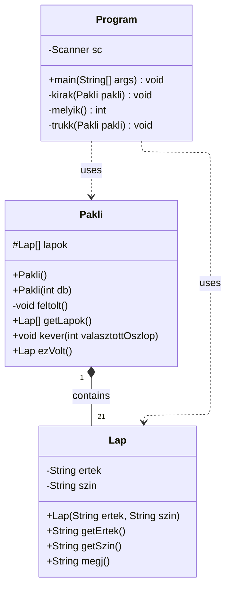

# Gondolat olvasó
## Feladat leírása:
A feladat egy kartya trükk elkészítése Netbeansben. Ahol a felhasználó kiválaszt egy kártyát
és 3 körön keresztül megadja melyik oszlopban szerepel. A program pedig kitalálja melyik kártyát választotta.
## Feladatok felosztása:
### Vera:
- Program elkészítése
### Tibi:
- Pakli osztály elkészítése
### Maja:
- Lap osztály elkészítése/ besegítés a másik két kód megírásában
## OOP:

